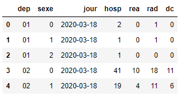
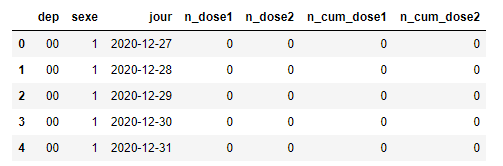
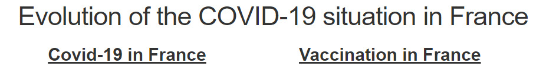

# COVID-19 in France : A first look at the global situation and vaccination process 

## Presentation of the datasets  

### COVID-19 dataset

    Concerning the COVID-19 dataset, we have observations since March 2020 up to today because the dataset is updated every day. We will explain after how we manage to get the correct dataset without downloading every version every day.
    Here, let's have a look at the dataset:  

    We see basics informations such as the department, the gender, the day and the then the four indicators of the situation:  
        - hosp : Indicate the number of hospitalisations
        - rea : Incated the number of reanimation
        - rad : Indicate the number of people that got back home
        - dec : Indicate the number of deaths

    We have all the informations to have some visualisation. However, we will create new columns at some points to group the hospitalisations by date for example or other things like that.   

### Vaccination dataset

    For the vaccination dataset, we took the one provided by the government. Like the previous dataset, this one is also updated every day but we have less observations since the vaccination campaign started at the end of December 2020.  

    Like before, we have some basics informations and now we have the numnber of doses administrated every day. We also have the cumulated number which will be useful for the representation.    
    However, we see some changes in the organisation. This time, the dataset is ordered by department and not by date so we will have to do different operations on this dataset.

## How we managed to get the latest dataset from the data.gouv website

    One of the difficulties for us was that the datasets are updated daily and so we need to get the latest updated one to have correct visualisation.   
    To solve this problem, we used some NLP technique that we saw some weeks ago : BeautifulSoup library.
    With that, we can look for all links in the html page and get a list of it. To have smaller list of results, we just select links that have the word "Télécharger". Even if the hour of publication is different, the order in the list is always the same. We just have to select the second link as it is the one that we want for the COVID-19 dataset. 

    Concerning the vaccination dataset, the structure of the file was updated recently and so all the operations that we did on the dataset weren't working anymore so we decided to stick with the original dataset that we took, stopping at March, 2nd.

## Dashboard structure

    Concerning the dahsboard, since we are working with two datasets, we will have two distinct visualisation. To get these 2 visualisations on the same dashboard, we decided to put two links on the dashboard, each one displaying one or the other visualisation. Here an image of the presentation page of the dashboard:   

    Here we see the two links to access the two visualisations. These links are permanent meaning that we can switch from one visualisation to another at any time.